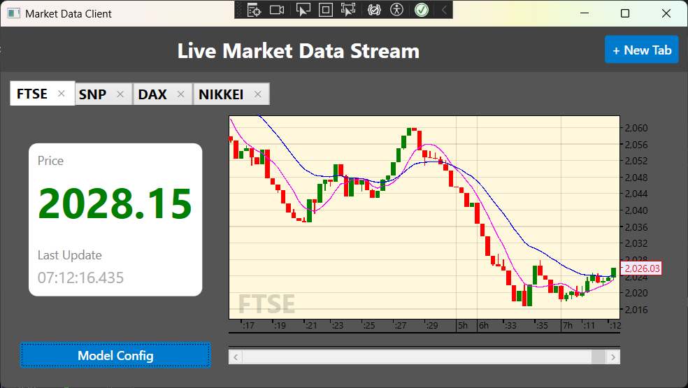
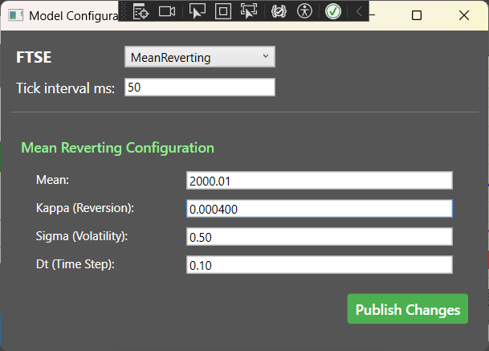
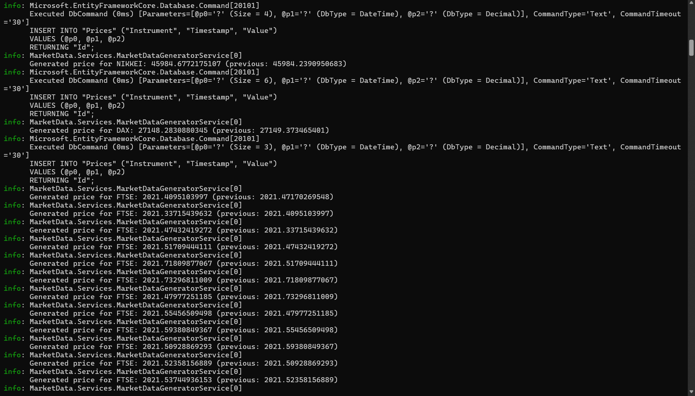
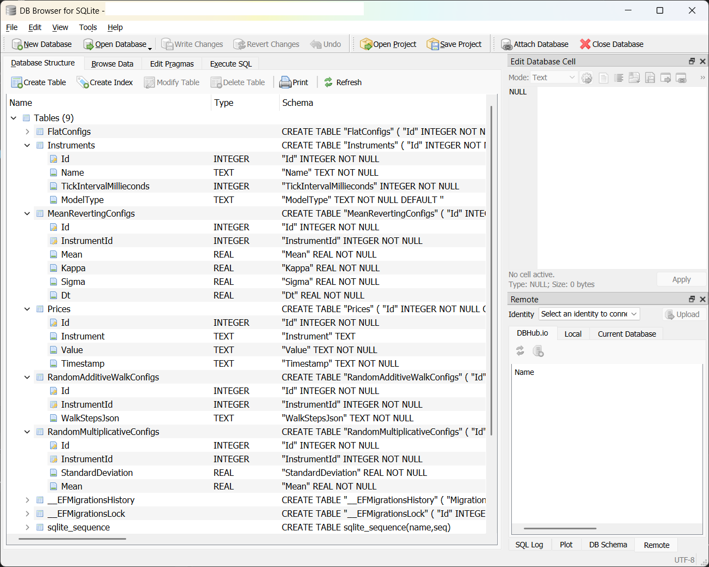
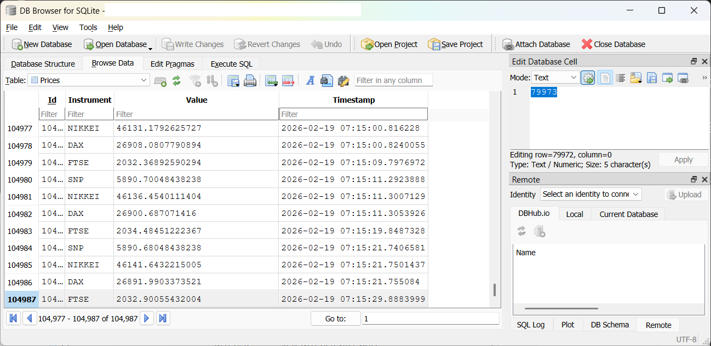

# Solution Motivations

The MarketData solution is a distributed system for simulating, generating, and visualizing real-time market price data. It demonstrates modern .NET development practices including gRPC streaming, background services, WPF data visualization, and hot-reloadable configuration.

My motivations were to show off my skills in API design and WPF in a fintech system. **It is purely a hobby project.**

I first wanted to create a small application that could stream market data, and another application that could "book" (fake) trades based on that data. After soon realizing that market data would come at some expense I decided to start simulating that data. I implemented some basic models. I then wanted to see what effect different model parameters would have on the ticking prices, so one thing led to another and this is where I have got to.

This is still work in progress, but see below where I have got to so far! Key features like the trading screen, security, containerisation and a more scalable RDBMS (currently I use SQLite) are yet to be implemented.


---

## Technology Stack

| Component | Technology |
|-----------|-----------|
| Backend Framework | ASP.NET Core 10.0 |
| Client Framework | WPF (.NET 10 Windows) |
| RPC Framework | gRPC |
| Database | SQLite with Entity Framework Core |
| ORM | Entity Framework Core 10.0 |
| Logging | Serilog with Seq |
| Charting | [FancyCandles 2.7.1](https://github.com/gellerda/FancyCandles) |
| API Documentation | OpenAPI with Scalar |
| Background Processing | IHostedService |
| Dependency Injection | Microsoft.Extensions.DependencyInjection |

---

## System Architecture


---

## Selected Screenshots











---

# MarketData Solution Architecture

## Projects

### 1. **MarketData** (ASP.NET Core Server)
**Type:** ASP.NET Core Web API with gRPC  
**Framework:** .NET 10  
**Key Technologies:** Entity Framework Core, gRPC, SQLite

**Purpose:**  
The core backend service that generates and streams real-time market data to clients.

**Key Components:**
- **Background Service:** `MarketDataGeneratorService` continuously generates price updates
- **gRPC Services:**
  - `MarketDataService` - Streams real-time price updates to subscribers
  - `ModelConfigurationGrpcService` - Manages price simulation model configurations
- **REST API:** Controllers for instruments and prices (via OpenAPI/Scalar)
- **Database:** SQLite for persisting instruments, prices, and model configurations
- **Model Management:** `IInstrumentModelManager` for configuration management via EF Core, including model parameters and instrument data (tick interval, active model) and adding new instruments

**Key Features:**
- Real-time price generation using multiple simulation models
- Hot reload of model configurations without service restart
- Per-instrument configurable tick intervals
- Streaming via gRPC for efficient real-time updates
- Persistent storage of price history

**Dependencies:**
- `MarketData.PriceSimulator` - Price simulation algorithms

---

### 2. **MarketData.Wpf.Client** (WPF Application)
**Type:** WPF Desktop Application  
**Framework:** .NET 10 Windows  
**Key Technologies:** WPF, gRPC Client, FancyCandles (chart control), MVVM pattern

**Purpose:**  
Rich desktop client for visualizing market data with real-time candlestick charts and model configuration.

**Key Components:**
- **ViewModels:** MVVM pattern with `MainWindowViewModel`, `InstrumentViewModel`, `InstrumentTabViewModel`
- **Views:** Multi-tab interface with candlestick charts and model configuration panels
- **gRPC Client:** Subscribes to real-time price streams from the server
- **Chart Integration:** FancyCandles library for professional candlestick visualization
- **Model Configuration UI:** Dynamic forms for editing simulation parameters

**Key Features:**
- Real-time candlestick charts with configurable timeframes
- Multi-instrument tabs
- Live model configuration editing with hot reload
- Visual representation of price simulation behavior
- Async initialization 

**Dependencies:**
- `MarketData.Wpf.Shared` - Shared WPF utilities (RelayCommand, ViewModelBase)
- `MarketData.Client.Shared` - Shared gRPC configuration
- Proto files linked from `MarketData` project

---

### 3. **MarketData.Client** (Console Application)
**Type:** Console Application  
**Framework:** .NET 10

**Purpose:**  
Lightweight console client for subscribing to market data streams. Useful for testing and demonstrations.

**Key Features:**
- Simple command-line interface
- Subscribe to multiple instruments
- Real-time console output of price updates
- Graceful shutdown on Ctrl+C

**Dependencies:**
- `MarketData.Client.Shared` - Shared gRPC configuration
- Proto files from `MarketData` project

---

### 4. **MarketData.PriceSimulator** (Class Library)
**Type:** Class Library  
**Framework:** .NET 10

**Purpose:**  
Core price simulation engine with multiple mathematical models for generating realistic market data.

**Price Simulation Models:**
- **RandomMultiplicativeProcess** - Percentage-based random walk
- **MeanRevertingProcess** - Ornstein-Uhlenbeck mean reversion
- **RandomAdditiveWalk** - Configurable step-based walk with custom patterns
- **Flat** - Static pricing (for testing)

**Key Interface:**
```csharp
public interface IPriceSimulator
{
    Task<double> GenerateNextPrice(double price);
}
```

**Features:**
- Each model implements `IPriceSimulator` for polymorphic usage
- Configurable parameters per model
- Stateless design (receives current price, returns next price)
- Used by both server and `FastSimulate` project

---

### 5. **FastSimulate** (Console Application)
**Type:** Quick Testing Console App  
**Framework:** .NET 10

**Purpose:**  
Standalone console application for rapidly testing and visualizing price simulator behavior without the full server infrastructure.

**Use Case:**  
Quick iteration and tuning of simulator parameters during development.

---

### 6. **MarketData.Wpf.Shared** (Class Library)
**Type:** Class Library  
**Framework:** .NET 10 Windows

**Purpose:**  
Shared WPF infrastructure components.

**Contents:**
- `ViewModelBase` - Base class for MVVM view models with INotifyPropertyChanged
- `RelayCommand` - ICommand implementation for MVVM
- Common WPF utilities

---

### 7. **MarketData.Client.Shared** (Class Library)
**Type:** Class Library  
**Framework:** .NET 10

**Purpose:**  
Shared configuration classes for gRPC clients.

**Contents:**
- `GrpcSettings` - Configuration model for server URL binding

---

## Data Flow

### 1. Price Generation Flow
```
[Timer Tick] 
    → [MarketDataGeneratorService]
        → [IPriceSimulator.GenerateNextPrice()]
            → [New Price]
                → [SQLite DB]
                → [gRPC Broadcast]
                    → [Connected Clients]
```

### 2. Model Configuration Flow
```
[Client UI Change]
    → [gRPC ModelConfiguration.UpdateConfig()]
        → [InstrumentModelManager]
            → [Validate & Update DB]
                → [Raise ConfigurationChanged Event]
                    → [MarketDataGeneratorService.HotReload()]
                        → [New Simulator Instance]
```

### 3. Client Subscription Flow
```
[Client Connect]
    → [SubscribeToPrices(instruments)]
        → [Server Stream Setup]
            → [MarketDataGeneratorService.RegisterSubscriber]
                → [Continuous Price Updates via gRPC Stream]
```

---

## Key Design Patterns

### 1. **Dependency Injection**
All projects use constructor injection for loose coupling and testability.

### 2. **Strategy Pattern**
`IPriceSimulator` allows swapping different price simulation algorithms at runtime.

### 3. **Factory Pattern**
- `PriceSimulatorFactory` creates appropriate simulators based on configuration
- `InstrumentViewModelFactory` creates view models with proper dependencies

### 4. **Observer Pattern**
- `IInstrumentModelManager.ConfigurationChanged` event for hot reload
- gRPC streaming for real-time price updates

### 5. **MVVM Pattern**
WPF client strictly follows MVVM for separation of concerns and testability.

### 6. **Repository Pattern**
Entity Framework DbContext abstracts data access.

---

## Communication Protocols

### gRPC Services

#### MarketDataService
**Proto:** `marketdata.proto`

```protobuf
service MarketDataService {
  rpc SubscribeToPrices (SubscribeRequest) returns (stream PriceUpdate);
  rpc GetHistoricalData (HistoricalDataRequest) returns (HistoricalDataResponse);
}
```

**Purpose:** Real-time price streaming and historical data retrieval

#### ModelConfigurationService
**Proto:** `modelconfiguration.proto`

```protobuf
service ModelConfigurationService {
    rpc GetAllInstruments(GetAllInstrumentsRequest) returns (GetAllInstrumentsResponse);
    rpc TryAddInstrument(TryAddInstrumentRequest) returns (TryAddInstrumentResponse);
    rpc TryRemoveInstrument(TryRemoveInstrumentRequest) returns (TryRemoveInstrumentResponse);
    rpc GetSupportedModels(GetSupportedModelsRequest) returns (SupportedModelsResponse);
    rpc GetConfigurations(GetConfigurationsRequest) returns (ConfigurationsResponse);
    rpc UpdateTickInterval(UpdateTickIntervalRequest) returns (UpdateConfigResponse);
    rpc SwitchModel(SwitchModelRequest) returns (SwitchModelResponse);
    rpc UpdateRandomMultiplicativeConfig(UpdateRandomMultiplicativeRequest) returns (UpdateConfigResponse);
    rpc UpdateMeanRevertingConfig(UpdateMeanRevertingRequest) returns (UpdateConfigResponse);
    rpc UpdateRandomAdditiveWalkConfig(UpdateRandomAdditiveWalkRequest) returns (UpdateConfigResponse);
}
```

**Purpose:** Remote configuration management for price simulation models

**Features:**
- Switch active model per instrument
- Update model-specific parameters
- Update tick intervals
- Get existing instruments and add new instruments (including seeding database with initial price)
- Hot reload without reconnection

---

## Database Schema

### Tables
- **Instruments** - Market instruments (stocks, indices, etc.)
- **Prices** - Time-series price data
- **RandomMultiplicativeConfig** - Configuration for multiplicative random walk
- **MeanRevertingConfig** - Configuration for mean-reverting process
- **FlatConfig** - Configuration for flat pricing
- **RandomAdditiveWalkConfig** - Configuration for additive walk with steps

### Relationships
- Each `Instrument` has one configuration per model type (one-to-one)
- `Instrument.ModelType` determines active model
- All configurations cascade delete with instrument

---

## Configuration

### Server Configuration
**File:** `MarketData/appsettings.json`
- Database connection string
- `MarketDataGeneratorOptions` - Generator settings
- Kestrel endpoints for HTTP/HTTPS/gRPC

### Client Configuration
**File:** `MarketData.Wpf.Client/appsettings.json` / `MarketData.Client/appsettings.json`
- `GrpcSettings.ServerUrl` - Server endpoint (default: `https://localhost:7264`)

---

## Development Workflow

### Running the Solution

1. **Start the Server:**

    (from the root of the git repo)
  
   ```bash
   dotnet run --project MarketData
   ```
     Server runs on `https://localhost:7264` (default)

     Optionally add `--seed-data` to seed database with a sample instrument and model config (e.g. for first-time setup)

     ```bash
     dotnet run --project MarketData --seed-data
     ```

3. **Start WPF Client:**
   ```bash
   dotnet run --project MarketData.Wpf.Client
   ```

4. **Start Console Client:**
   ```bash
   cd MarketData.Client
   dotnet run
   ```

### Notes & troubleshooting

- Logs are automatically logged to file, and additionally Seq (if it is running - see below secition on logging to see how to set up a Seq service in Docker)
- If running in WSL you may need to install the SDK, below is an example for Ubuntu
  ```bash
  # Add Microsoft package repository
  wget https://packages.microsoft.com/config/ubuntu/$(lsb_release -rs)/packages-microsoft-prod.deb -O packages-microsoft-prod.deb
  sudo dpkg -i packages-microsoft-prod.deb
  rm packages-microsoft-prod.deb

  # Update and install
  sudo apt update
  sudo apt install -y dotnet-sdk-10.0

  # Verify
  dotnet --version
  ```

### Database Migrations
```bash
cd MarketData
dotnet ef migrations add <MigrationName>
dotnet ef database update
```

Note: Migrations are automatically applied in development environment. In production this should be done in deployment.

---

## Extension Points

### Adding New Price Simulators
1. Create new class implementing `IPriceSimulator` in `MarketData.PriceSimulator`
2. Add configuration model to `MarketData/Models/`
3. Update `MarketDataContext` with new DbSet and relationship
4. Update `PriceSimulatorFactory` to handle new model
5. Add gRPC configuration methods to `ModelConfigurationGrpcService`
6. Create WPF view for configuration in `MarketData.Wpf.Client/Views/ModelConfigs/`

### Adding New Instruments

#### gRPC API

1. Call `TryAddInstrument` with new instrument name, tick interval and initial price, and optionally initial model type
2. Server creates new instrument, seeds initial price.
3. If no configuration provided, defaults to `Flat` (`const` hardcoded in `InstrumentModelManager`); otherwise, uses default parameters for the specified model type.
4. Event is raised, background service hot reloads, new price stream starts immediately.

#### Manual 

1. Insert into `Instruments` table
2. Create initial price record
3. Set desired `ModelType` and create corresponding configuration
4. Set tick interval
5. Restart server

---

## Performance Considerations

- **gRPC Streaming:** Efficient binary protocol with HTTP/2 multiplexing
- **Background Service:** Asynchronous price generation prevents blocking
- **Concurrent Dictionaries:** Thread-safe price simulator management
- **Entity Framework:** AsNoTracking for read-only queries
- **WPF Async:** Proper async/await patterns prevent UI freezing
- **Hot Reload:** Individual instrument updates without full restart

---

## Security Considerations

- Server runs on HTTPS by default
- gRPC uses HTTP/2 with TLS
- No authentication currently implemented (suitable for local development)

---

## Logging

See [LOGGING.md](LOGGING.md)

---

## Testing

See [TESTING.md](TESTING.md)

---

## Future Enhancements

- Authentication and authorization
- Performance metrics and monitoring*
- Docker containerization
- Cloud deployment (Azure, AWS)
- Trade execution simulation
- Multi-user support with isolated workspaces
- More sophisticated simulation models (volatility clustering, jump processes)

\* *Part implemented with Serilog and Seq, OpenTelemetry is WIP: https://github.com/szigh/MarketData/tree/13-add-opentelemetry-for-metrics-and-monitoring*

---

## Project Dependencies Graph

```
MarketData.Wpf.Client
    ├── MarketData.Wpf.Shared
    ├── MarketData.Client.Shared
    └── (Proto files from MarketData)

MarketData.Client
    ├── MarketData.Client.Shared
    └── (Proto files from MarketData)

MarketData
    └── MarketData.PriceSimulator

FastSimulate
    └── MarketData.PriceSimulator

MarketData.Wpf.Shared
    └── (No dependencies)

MarketData.Client.Shared
    └── (No dependencies)

MarketData.PriceSimulator
    └── (No dependencies)

# Test Projects
MarketData.Tests
    ├── MarketData (project reference)
    ├── MarketData.PriceSimulator (project reference)
    └── Testing Libraries (xUnit, Moq, EF InMemory, ASP.NET Testing)

MarketData.PriceSimulator.Tests
    ├── MarketData.PriceSimulator (project reference)
    └── Testing Libraries (xUnit)
```

---

Resources:
- [FancyCandles 2.7.1](https://github.com/gellerda/FancyCandles)
- [Serilog Documentation](https://serilog.net/)

---

**Created:** 2026  
**License:** MIT  
**Type:** Hobby Project / Portfolio Demonstration
